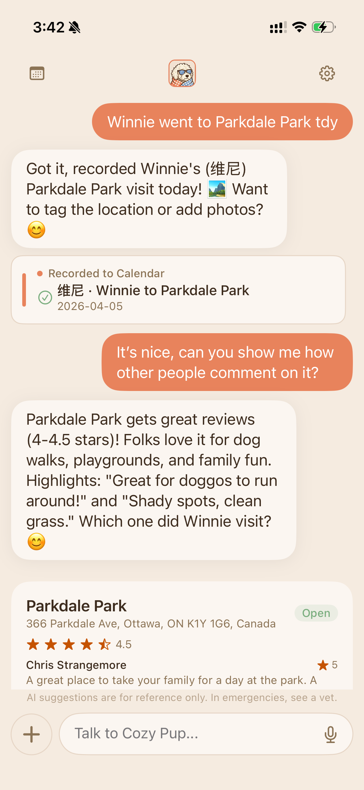
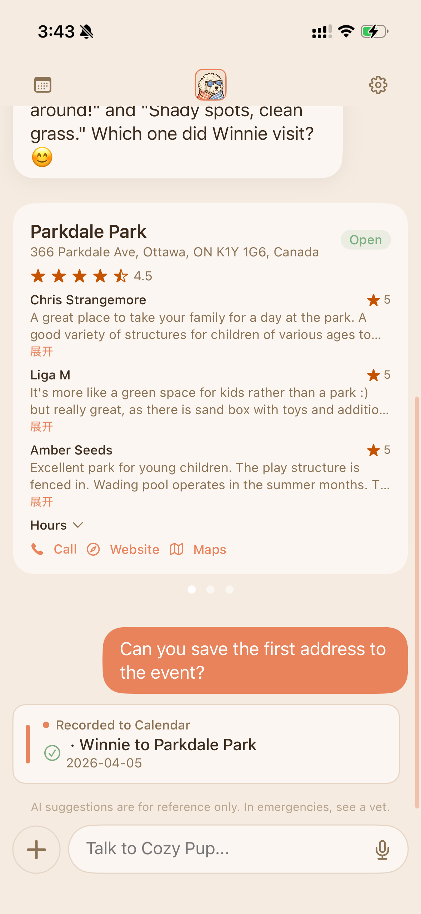
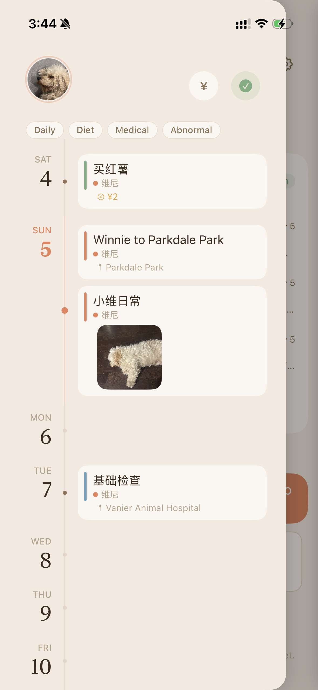

# CozyPup

**English** | [中文](README.zh.md)

AI-powered pet health assistant. One chat interface handles everything — recording events, managing pet profiles, finding nearby vets, setting reminders. No forms, no buttons, no onboarding wizards. Users talk to the AI, and the AI executes.

Native SwiftUI iOS app + FastAPI Python backend + PostgreSQL (Neon) + LLM via LiteLLM.

**Live on Google Cloud Run.** iOS app in TestFlight.

## Screenshots

<p align="center">
  
  
  
  
</p>

---

## Architecture Overview

```
┌─────────────────────────────────────────────────────────────────┐
│  iOS (SwiftUI)                                                  │
│  ChatView → ChatStore → ChatService (SSE) → APIClient          │
│  CalendarDrawer / Settings / Cards (PlaceCard, RecordCard, ...) │
└──────────────────────────┬──────────────────────────────────────┘
                           │ SSE (token / card / emergency / done)
┌──────────────────────────▼──────────────────────────────────────┐
│  FastAPI Backend                                                │
│                                                                 │
│  POST /api/v1/chat ─── SSE EventSourceResponse                 │
│    │                                                            │
│    ├─ Phase 0: Session + Message persistence                    │
│    ├─ Phase 1: Parallel pre-processing (regex, <1ms)            │
│    │   ├─ Emergency keyword detection                           │
│    │   ├─ Intent extraction → SuggestedActions                  │
│    │   └─ Language detection                                    │
│    ├─ Phase 2: Prompt assembly (cache-optimized order)          │
│    │   ├─ Tool definitions + decision tree (100% cache hit)     │
│    │   ├─ Pet profiles (high cache hit)                         │
│    │   ├─ Context summary (lazy compression)                    │
│    │   └─ Emergency/preprocessor hints (dynamic)                │
│    └─ Phase 3: Orchestrator loop (max 5 rounds)                 │
│        ├─ Stream LLM → tokens to client                        │
│        ├─ Tool calls → validate → execute → feed back           │
│        ├─ Nudge: retry if LLM missed expected tools             │
│        └─ Plan nag: enforce multi-step completion               │
│                                                                 │
│  Parallel: Profile extractor (async, non-blocking)              │
│  Parallel: Context compression (lazy, threshold-based)          │
└─────────────────────────────────────────────────────────────────┘
```

---

## Constrained Agent Framework

The core insight: **LLM outputs are treated as suggestions, not commands.** Every tool call is validated, gate-checked, and auto-corrected before execution. A deterministic pre-processor provides fallback — if the LLM fails, the system still executes the most-likely-intended action.

This allows using cheaper, faster models (Grok 4.1 Fast for daily chat, Kimi K2.5 for emergencies) while maintaining accuracy that typically requires expensive models.

### The Six Layers

```
User Message
    │
    ▼
┌─────────────────────────────────────────────────┐
│ 1. PRE-PROCESSOR (deterministic, <1ms)          │
│    Regex extracts intent + args → SuggestedAction│
│    Confidence 0.0-1.0 per action                │
│    Injected as hints into system prompt          │
└────────────────────┬────────────────────────────┘
                     ▼
┌─────────────────────────────────────────────────┐
│ 2. LLM ORCHESTRATOR (streaming, max 5 rounds)   │
│    LLM decides what to do via function calling   │
│    Each tool call goes through layers 3-5:       │
│    ┌───────────────────────────────────────────┐ │
│    │ 3. VALIDATION — schema + format checks    │ │
│    │    Errors fed back to LLM for auto-fix    │ │
│    ├───────────────────────────────────────────┤ │
│    │ 4. CONFIRM GATE — destructive ops blocked │ │
│    │    Card shown to user, execution deferred │ │
│    ├───────────────────────────────────────────┤ │
│    │ 5. EXECUTOR — ownership check + DB write  │ │
│    │    Returns result + card for frontend     │ │
│    └───────────────────────────────────────────┘ │
│    If LLM missed tools → NUDGE (one retry)       │
│    If plan incomplete → PLAN NAG (continue)      │
└────────────────────┬────────────────────────────┘
                     ▼
┌─────────────────────────────────────────────────┐
│ 6. POST-PROCESSOR (deterministic fallback)       │
│    If LLM claimed "done" but called no tools:    │
│    Execute pre-processor's high-confidence        │
│    suggestions directly (≥0.8 confidence)         │
└─────────────────────────────────────────────────┘
```

### Why This Matters

| Problem | Naive LLM+Tools | Constrained Agent |
|---------|-----------------|-------------------|
| LLM says "recorded" but didn't call tool | Data loss | Post-processor catches and executes |
| LLM passes invalid date format | Tool crashes | Validator rejects, LLM auto-corrects |
| LLM merges "walked dog + gave bath" into one event | Lost data | Plan tool forces decomposition |
| LLM forgets to call search_places | "I don't know nearby vets" | Nudge mechanism retries with explicit instruction |
| User says "delete my pet" | Instant deletion | Confirm gate shows card, user must approve |
| Emergency: "my dog is seizing" | Generic advice | Keyword detection → model upgrade → trigger_emergency tool |

### Tool Inventory (34 tools)

| Domain | Tools |
|--------|-------|
| Calendar | create/query/update/delete_calendar_event, upload/remove_event_photo, add_event_location |
| Pets | create/delete_pet, update_pet_profile, set_pet_avatar, summarize_pet_profile, list_pets |
| Reminders | create/update/delete/delete_all/list_reminders |
| Places | search_places, search_places_text, get_place_details, get_directions |
| Tasks | manage_daily_task |
| Other | draft_email, trigger_emergency, set_language, plan, request_images |

### Orchestrator Loop Detail

```python
# Simplified orchestrator flow (orchestrator.py)

MAX_ROUNDS = 5

for round in range(MAX_ROUNDS):
    # 1. Stream LLM response
    text, tool_calls = await stream_completion(messages, tools)

    if not tool_calls:
        # 2a. Check plan completion
        if plan_steps and not all_covered:
            inject_plan_nag()  # "You planned 3 steps but only did 2"
            continue

        # 2b. Check nudge
        missed = find_missed_tools(suggested_actions, tools_called)
        if missed and not nudge_used:
            inject_nudge(missed)  # "You should have called search_places"
            continue

        break  # Normal exit

    # 3. Execute each tool call
    for tc in tool_calls:
        args = parse_arguments(tc)
        errors = validate_tool_args(tc.name, args)  # Layer 3
        if errors:
            feed_error_to_llm(errors)
            continue

        if tc.name in CONFIRM_TOOLS:                # Layer 4
            emit_confirm_card(tc)
            continue

        result = await execute_tool(tc.name, args)  # Layer 5
        if result.get("card"):
            emit_card(result["card"])
        feed_result_to_llm(result)
```

---

## Context Management

### Lazy Compression (`context_agent.py`)

Instead of stuffing 20 raw messages into the prompt, CozyPup uses a context agent:

```
Long-term context: pet.profile_md (auto-updated by profile_extractor)
Short-term context: session_summary (compressed by context_agent)
Recent messages: last 3-5 raw messages
```

**Trigger**: When unsummarized messages ≥ 5, an async context agent (cheap model, temperature=0.1) compresses them into a structured summary:

```json
{
  "topics": ["discussed vaccine schedule", "recorded daily walk"],
  "key_facts": ["next vaccine due April 15", "vet appointment confirmed"],
  "pending": "user asked about nearby groomers but hasn't chosen one",
  "mood": "casual"
}
```

This achieves ~60-70% token reduction while preserving conversation continuity.

### Profile Extraction (`profile_extractor.py`)

Runs in parallel with the main orchestrator (non-blocking). Extracts pet health info from natural conversation and merges it into `pet.profile_md`:

```
User: "维尼对鸡肉过敏，上次吃了就吐"
→ Extractor detects: allergy info for pet "维尼"
→ Merges into profile_md under ## 健康 section
→ Future conversations reference this automatically
```

---

## Emergency Pipeline

```
User message: "我的狗在抽搐！"
    │
    ├─ emergency.py: regex matches "抽搐" → EmergencyCheckResult(detected=True)
    │
    ├─ Model switch: daily model (Grok 4.1 Fast) → emergency model (Kimi K2.5)
    │
    ├─ Prompt injection: "⚠️ Emergency keyword detected: [抽搐]. Evaluate and
    │   call trigger_emergency if this is a real emergency."
    │
    └─ LLM decides:
        ├─ Real emergency → trigger_emergency(action="find_er") → emergency SSE event
        └─ False alarm ("上次抽搐是什么时候") → normal text reply
```

Key: regex does cheap pre-filtering, LLM makes the final judgment. No false positives from keyword-only detection.

---

## SSE Streaming Protocol

```
event: token\ndata: {"text": "帮你"}\n\n
event: token\ndata: {"text": "记录了"}\n\n
event: card\ndata: {"type": "record", "pet_name": "维尼", "date": "2026-04-05", ...}\n\n
event: emergency\ndata: {"message": "...", "action": "find_er"}\n\n
event: done\ndata: {"intent": "chat", "session_id": "..."}\n\n
```

iOS `ChatService.swift` parses SSE events into a typed `AsyncStream<SSEEvent>` enum, yielding tokens for real-time display and cards for structured UI rendering.

---

## iOS Architecture

```
ios-app/CozyPup/
├── Services/
│   ├── APIClient.swift       # Swift actor, JWT management, SSE streaming
│   ├── ChatService.swift     # SSE parser → AsyncStream<SSEEvent>
│   ├── CalendarSyncService.swift  # EventKit sync (per-pet calendars)
│   └── SpeechService.swift   # Speech-to-text
├── Stores/                   # @MainActor ObservableObject, API-first
│   ├── ChatStore.swift       # Message persistence, daily session reset
│   ├── CalendarStore.swift   # CRUD via API, Apple Calendar sync
│   ├── PetStore.swift        # Pet CRUD with UserDefaults cache
│   └── AuthStore.swift       # Apple/Google OAuth + JWT
├── Models/
│   └── ChatMessage.swift     # CardData enum (12 card types, auto-decoded from SSE)
└── Views/
    ├── Chat/ChatView.swift   # Main chat interface
    ├── Calendar/             # Timeline, spending stats, drawer
    ├── Cards/                # PlaceCard, PlaceDetailCard, DirectionsCard, RecordCard, ...
    └── Settings/             # Pet management, calendar sync, language
```

**Design system**: Timepage-inspired minimalist aesthetic. All UI uses `Tokens.*` (colors, fonts, spacing, radius) — zero hardcoded values.

---

## Backend Structure

```
backend/app/
├── main.py                   # App factory, middleware stack
├── config.py                 # pydantic-settings from env
├── auth.py                   # JWT + Apple/Google OAuth
├── models.py                 # SQLAlchemy models (User, Pet, CalendarEvent, Reminder, ...)
├── database.py               # Async engine + session
├── routers/                  # REST endpoints (chat, calendar, pets, reminders, ...)
├── agents/
│   ├── orchestrator.py       # Unified loop: stream → dispatch → validate → execute
│   ├── validation.py         # Per-tool schema validators with auto-correction
│   ├── locale.py             # Bilingual prompts + tool decision tree
│   ├── prompts_v2.py         # Cache-optimized prompt assembly
│   ├── emergency.py          # Keyword detection + model routing
│   ├── context_agent.py      # Lazy context compression
│   ├── profile_extractor.py  # Parallel pet profile enrichment
│   ├── post_processor.py     # Deterministic fallback execution
│   ├── trace_collector.py    # Debug trace (X-Debug: true header)
│   ├── constants.py          # CONFIRM_TOOLS, MAX_ROUNDS
│   ├── pre_processing/       # Regex-based intent extraction (6 domain modules)
│   └── tools/
│       ├── definitions.py    # 34 tool schemas (LLM function calling)
│       ├── registry.py       # @register_tool decorator
│       ├── calendar.py       # Event CRUD + photo + location
│       ├── pets.py           # Pet management + profile
│       ├── reminders.py      # Push notification reminders
│       ├── misc.py           # Places, email, emergency, language, directions
│       └── tasks.py          # Daily task management
├── services/
│   ├── places.py             # Google Places + Directions API (cached)
│   └── push.py               # APNs push notifications
├── middleware/                # Rate limiting, CORS
└── debug/                    # Structured logging, error snapshots, CLI tools
```

---

## Deployment

- **Backend**: Google Cloud Run (Montreal), auto-deployed via Cloud Build on push to main
- **Database**: Neon PostgreSQL (serverless)
- **LLM**: LiteLLM → Grok 4.1 Fast (daily) / Kimi K2.5 (emergency)
- **Storage**: GCS bucket for pet avatars + local disk for event photos
- **Secrets**: Google Secret Manager

---

## Tech Stack

| Layer | Technology |
|-------|-----------|
| iOS | SwiftUI, Combine, MapKit, EventKit, Speech |
| Backend | FastAPI, SQLAlchemy (async), Alembic, LiteLLM |
| Database | PostgreSQL (Neon serverless) |
| LLM | Grok 4.1 Fast, Kimi K2.5 (via LiteLLM) |
| Maps | Google Places API, Google Directions API |
| Auth | Apple Sign-In, Google Sign-In, JWT |
| Deploy | Google Cloud Run, Cloud Build, Secret Manager |
| Push | APNs (Apple Push Notification service) |

---

## Key Design Decisions

1. **Chat-only input** — No forms, no onboarding. Everything through natural conversation.
2. **Orchestrator + Executor** — LLM decides *what* to do (function calling), pure code *executes* it.
3. **Constrained Agent** — Validation + nudge + plan tracking + post-processor makes cheap models reliable.
4. **Daily sessions** — One chat session per calendar day, auto-created on first message.
5. **Dual-model routing** — Fast model for chat, accurate model for emergencies.
6. **API-first iOS** — Stores call backend first, fall back to UserDefaults cache on failure.
7. **SSE streaming** — Real-time token display + structured card delivery in single stream.

---

## Development

### Backend
```bash
cd backend
source .venv/bin/activate
pip install -e .
uvicorn app.main:app --reload --port 8000
```

### iOS
Open `ios-app/CozyPup.xcodeproj` in Xcode → Cmd+R. Requires Xcode 16+, deployment target iOS 17.0.

### Tests
```bash
cd backend && pytest tests/ -v
```
