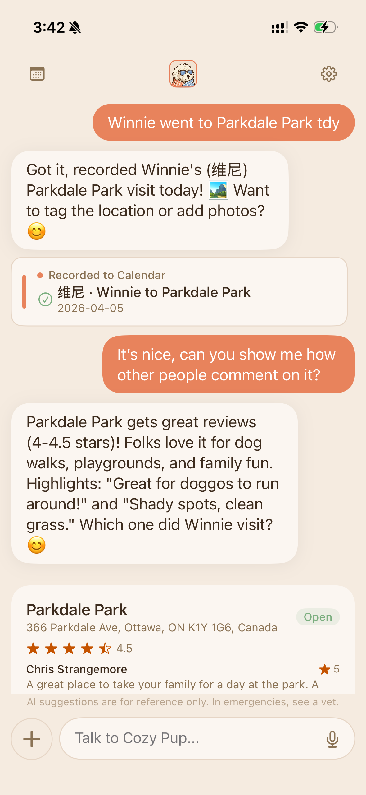
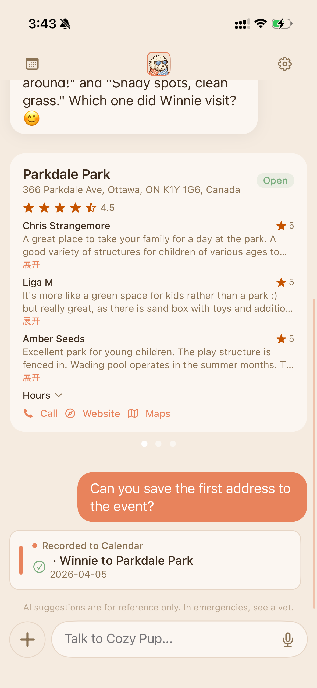
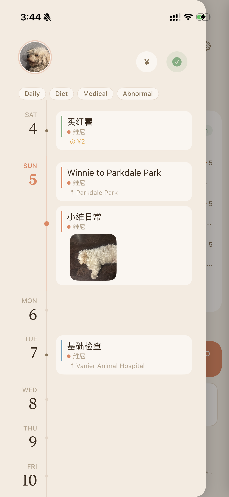

# CozyPup

[](https://github.com/RobertWang4/CozyPup/actions/workflows/ci.yml)
[](LICENSE)
[](https://www.python.org/)

**English** | [中文](README.zh.md)

AI-powered pet health assistant. One chat interface handles everything — recording events, managing pet profiles, finding nearby vets, setting reminders. No forms, no buttons, no onboarding wizards. Users talk to the AI, and the AI executes.

Live on Google Cloud Run; the iOS app ships through TestFlight. **This repo is the backend.** The SwiftUI client (`ios-app/`) is a private checkout and is not published here.

## Screenshots

<p align="center">
  
  
  
  
</p>

## Results

Every number below is reproducible from this repo; the source is named in each row. Nothing here is extrapolated.

| What | Result | Source |
|---|---|---|
| Agent regression suite, `pass^2` (18 curated scenarios, each run twice, both must pass) | **94%**, up from 83% before the LangGraph migration | [`docs/agent-request-flow.md`](docs/agent-request-flow.md#迁移结果) |
| Emergency classifier (fine-tuned Qwen3-0.6B, Q8) | **F1 0.948** — recall 0.982, precision 0.917 | [`backend/nano/README.md`](backend/nano/README.md) |
| …vs. the keyword regex it replaces | F1 0.47 — recall 0.375, precision 0.636 | same |
| Classifier latency, 4 threads (Cloud Run sidecar budget: p95 < 300ms) | p50 20ms / p95 22ms | same |
| Knowledge retrieval top-1 / top-3 (zh, n=60) | 88.3% / 96.7% | [`backend/eval_history/`](backend/eval_history/) |
| Knowledge retrieval top-1 / top-3 (en, n=30) | 93.3% / 100% | same |
| Safety red-line cases (dosage / diagnosis / human medicine) | 14 / 14 pass | same |
| Unit suite | 650 passed, 9 skipped, 62% line coverage | `pytest tests --ignore=tests/e2e --cov=app` |

## Architecture

```
 iOS (SwiftUI, private repo)                    ChatView → ChatStore → ChatService
        │  SSE: token / thinking / card / emergency / done
        ▼
 FastAPI   POST /api/v1/chat ── EventSourceResponse
   Phase 0  session + message persistence (one session per calendar day)
   Phase 1  parallel pre-processing: language, emergency regex, nano classifier,
            intent extraction → SuggestedAction(tool, args, confidence)
   Phase 2  prompt assembly, static → dynamic for prefix-cache hits
            + MemWeaver retrieval (pgvector: user memory ∪ global knowledge)
   Phase 3  LangGraph agent graph, MAX_ROUNDS = 5:

              START → prepare → model ──tool_calls──→ tools ──→ model
                                  │                     │
                                  │ none                ├─deferred─→ confirm ⇄
                                  ▼                     ▼      (interrupt)
                                review ──retry──→     finalize → END

   Phase 4  non-blocking: profile extraction, memory sync, context compression

 Postgres (Supabase) — app tables + pgvector + LangGraph checkpoints
 Sidecar  llama-server on :8081 — Qwen3-0.6B emergency classifier
```

### The constrained-agent idea

**LLM outputs are treated as suggestions, not commands.** Every tool call passes through code that can reject or repair it: a schema validator returns an error list instead of raising, and the errors are fed back as a tool result so the model fixes its own arguments next round; an ownership check makes a wrong `pet_id` impossible to write; destructive calls are deferred, never executed on the model's word alone. A deterministic regex pre-processor runs first and attaches confidence-scored `SuggestedAction`s to the prompt, so when the model skips an obvious write the `review` node can nudge it, and a post-processor can execute high-confidence actions outright if the nudge also fails. Nothing in the loop depends on the model behaving well. That is what makes a cheap model (DeepSeek V4.1 Flash) accurate enough to ship, with a stronger one (`gpt-5`) reserved for emergencies.

Since 2026-09 the loop is a **LangGraph** graph rather than a hand-written `while`. The payoff is the confirm gate: a destructive call parks itself, the turn finishes normally so the model can still use its other tools' results, and then `interrupt()` checkpoints the whole graph to Postgres. Tapping confirm resumes that thread with `Command(resume=True)` and executes the *stored* arguments — the model is never asked again, so it cannot change its mind. Full walkthrough: [`docs/agent-request-flow.md`](docs/agent-request-flow.md).

### Failure modes this buys you

| Problem | Naive LLM + tools | Here |
|---|---|---|
| Model says "recorded" but called no tool | Silent data loss | write-claim nag, then post-processor executes it |
| Model passes an invalid date format | Tool crashes | validator rejects, model auto-corrects next round |
| Model merges "walked dog + gave bath" into one event | Lost data | `plan` tool forces decomposition, plan nag enforces it |
| Model forgets `search_places` | "I don't know any nearby vets" | nudge retries with an explicit instruction |
| User says "delete my pet" | Instant deletion | deferred → confirm card → `interrupt` → resume with stored args |
| "My dog is seizing" | Generic advice | classifier + regex → model upgrade → `trigger_emergency` |

## What's notable

**Fine-tuned emergency router** (`backend/nano/`) — a LoRA fine-tune of Qwen3-0.6B that decides whether a message is a real emergency and deserves the expensive model. Reads the logprobs of the `true`/`false` tokens from one forward pass, so it returns a probability rather than a label and the threshold is tunable toward recall. Exported to GGUF, Q8-quantized, and deployed as a llama-server sidecar container next to the backend on Cloud Run. `app/agents/emergency_clf.py` merges its verdict with the old regex under a four-stage rollout flag (`off` → `shadow` → `union` → `clf`); production is on **`shadow`** — the model is called and logged but the regex still routes, and every disagreement is logged with `disagree=true` for the next training round. The README in `nano/` is written as a teaching log: the 606-item hand-checked eval set, why accuracy is the wrong metric, and the shortcut the model learned at each round (r1: "short = false"; r2: "name + vomited = true") plus the minimal contrast pairs that fixed it.

**Eval harness** (`backend/app/agent_harness/`) — scenario-driven evals against a live backend. Deterministic graders (`graders.py`) check tools called, tools actually executed, card types, and DB side effects; an LLM judge (`judge.py`) handles the text-quality rubrics code can't, with the product's own conventions in its system prompt so it doesn't fail a correct reply for being terse. `--repeat N` plus `--baseline` gives the `pass^2` metric that separates real regressions from model jitter, and `report.py` flags any scenario whose pass rate dropped against a previous report. 18 curated scenarios plus 354 migrated from the old e2e suite.

**MemWeaver memory + knowledge** (`backend/app/memory/`) — one pgvector query UNIONs the user's own `behavioral` / `cognitive` memory nodes with global `knowledge` chunks, filtered by species and cosine distance, with behavioral hits re-weighted by recency. Calendar writes and deletes sync their own memory nodes. Exposed both as eager prompt context and as a `search_knowledge` tool, which returns a references card the app can open.

**Admin CLI** (`backend/app/admin_cli/`) — `admin` for real operations: user inspection, subscription grants and refunds, bans, feature flags, rate-limit and session resets, full pipeline replay of any request by correlation id. Every write leaves a row in `admin_audit_log` with the operator and a mandatory `--reason`. See [`docs/ADMIN_CLI.md`](docs/ADMIN_CLI.md).

**33 tools** across calendar, pets, reminders, places, daily tasks, knowledge, and control (`plan`, `request_images`, `set_language`); 5 of them gated behind confirmation.

## Setup

```bash
cd backend
python -m venv .venv && source .venv/bin/activate
pip install -e ".[dev]"          # drop [dev] for a runtime-only install
```

Create `backend/.env` (see `.env.example`). Minimum for a working chat loop:

| Key | Notes |
|---|---|
| `DATABASE_URL` | `postgresql+asyncpg://…` — Supabase session pooler in production |
| `MODEL_API_BASE` / `MODEL_API_KEY` | OpenAI-compatible endpoint for `MODEL` (default `deepseek/deepseek-flash`) |
| `JWT_SECRET` | any non-default value |

Optional: `EMERGENCY_MODEL` with its own `EMERGENCY_MODEL_API_BASE` / `_API_KEY`; `EMBEDDING_API_KEY` for memory and knowledge retrieval; `GOOGLE_PLACES_API_KEY` for vet/groomer search; `EMERGENCY_CLF_URL` to enable the classifier sidecar; `APNS_*` for push; `DOUBAO_*` for streaming speech input; `GCS_BUCKET` for avatar uploads.

```bash
alembic upgrade head                         # migrations
uvicorn app.main:app --reload --port 8000    # server
ruff check app                               # lint
pytest tests --ignore=tests/e2e              # unit tests (no DB or API keys needed)
docker build -t cozypup-backend .            # same image Cloud Build deploys
```

Evals hit a real backend and cost real tokens:

```bash
agent eval scenarios/agent --env prod --repeat 2 --report reports/run.json
python -m nano.cli eval --predictor keyword           # classifier baselines
```

## Docs

- [`docs/agent-request-flow.md`](docs/agent-request-flow.md) — one message end to end: the graph, its state, the confirm interrupt
- [`docs/ADMIN_CLI.md`](docs/ADMIN_CLI.md) — full operator CLI reference
- [`docs/debug-guide.md`](docs/debug-guide.md) — tracing a user-reported bug from error to regression test
- [`backend/nano/README.md`](backend/nano/README.md) — the classifier fine-tune, written as a teaching log
- [`CLAUDE.md`](CLAUDE.md) — working notes: conventions, deployment, the checklist for adding a tool
- `web-demo/` — static HTML mockups of the iOS screens (design reference, no backend)

## Stack

| Layer | Technology |
|---|---|
| Backend | FastAPI, SQLAlchemy 2 (async), Alembic, LangGraph, LiteLLM |
| Database | PostgreSQL on Supabase (session pooler) + pgvector |
| LLM | DeepSeek V4.1 Flash (chat) · `gpt-5` (emergency) · Qwen3-0.6B LoRA (routing) · `text-embedding-3-small` |
| iOS (private) | SwiftUI, Combine, MapKit, EventKit, Speech |
| Platform | Cloud Run (Montreal), Cloud Build, Secret Manager, GCS, APNs |
| Auth | Apple Sign-In, Google Sign-In, JWT |

## License

MIT — see [LICENSE](LICENSE).
