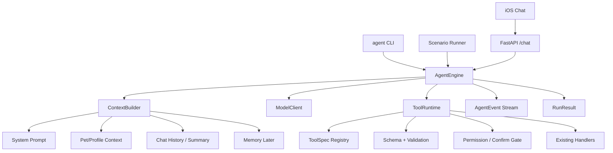

# Agent Harness V2 Implementation Plan

> **For Claude:** REQUIRED SUB-SKILL: Use superpowers:executing-plans to implement this plan task-by-task.

**Goal:** Turn CozyPup's current chat agent into a Claude-Code-inspired agent harness with a reusable runtime, typed tool protocol, formal event/result stream, scenario evals, and future fine-tuning data capture.

**Architecture:** Keep the current product behavior working while extracting the agent core from the FastAPI chat route into an `AgentEngine`. Introduce `ToolSpec`, `ToolRuntime`, `AgentEvent`, and `RunResult` beside the existing orchestrator first, then migrate one boundary at a time. Do not start memory or LoRA work until the runtime and eval harness can reliably produce traces.

**Tech Stack:** Python 3.14, FastAPI, LiteLLM/OpenAI-style tool calling, pytest, click CLI, existing SSE chat endpoint, existing CozyPup SQLAlchemy models.

---

## Why This Plan Exists

This is the plan that matches the valuable part of the June 11 discussion: not "build another wrapper", and not "jump straight to LoRA", but use CozyPup as a serious agent engineering project.

The target is inspired by Claude Code's source layout:

- `/Users/robert/Projects/claude-code-soource/claude-code-source/src/QueryEngine.ts`
- `/Users/robert/Projects/claude-code-soource/claude-code-source/src/query.ts`
- `/Users/robert/Projects/claude-code-soource/claude-code-source/src/Tool.ts`
- `/Users/robert/Projects/claude-code-soource/claude-code-source/src/services/tools/toolExecution.ts`
- `/Users/robert/Projects/claude-code-soource/claude-code-source/src/tools/ToolSearchTool/ToolSearchTool.ts`
- `/Users/robert/Projects/claude-code-soource/claude-code-source/src/memdir/memdir.ts`

The lesson is not to copy Claude Code literally. Claude Code is a coding agent. CozyPup is a pet-health/product agent. The reusable idea is:

```text
agent = model + loop + context builder + tool protocol + permissions + events + evals
```

The current CozyPup agent already has a good simplified version:

- `backend/app/agents/orchestrator.py`
- `backend/app/agents/tools/definitions.py`
- `backend/app/agents/tools/registry.py`
- `backend/app/agents/validation.py`
- `backend/app/agents/constants.py`
- `backend/app/agents/trace_collector.py`
- `backend/app/agent_harness/cli.py`

The gap is that the boundaries are still not formal enough. Tool metadata is split across several files, the trace is debug-only instead of a stable event protocol, and the main runtime is still tied to the `/chat` route shape.

## Non-Goals

- Do not implement MemWeaver-style memory in this pass.
- Do not fine-tune Qwen/LoRA in this pass.
- Do not replace the existing production chat behavior in one rewrite.
- Do not make a generic agent framework detached from CozyPup.
- Do not make ordinary RAG/agent demo features just for appearance.

## Target Architecture



## Success Criteria

- The iOS `/api/v1/chat` user experience still works.
- The local `agent chat` CLI still works against local and remote backends.
- There is a reusable `AgentEngine` API that can be called without constructing an HTTP SSE response.
- Every tool has one canonical `ToolSpec` source of truth for schema, description, handler, validation, confirmation policy, and safety metadata.
- Every run emits stable events that can be rendered by CLI, sent over SSE, and saved for eval/fine-tuning.
- Scenario evals can assert expected tool calls and final side effects.
- Prompt length can begin to shrink because tool metadata moves out of giant prompt text and into structured manifests.

## Learning Outcome

This refactor should teach:

- Agent loop design.
- Tool calling protocol design.
- Permission and confirmation gates.
- Context engineering.
- Trace/event protocol design.
- Agent eval design.
- How production traces become future SFT/LoRA data.

Resume version:

```text
Built a Claude-Code-inspired agent harness for a production pet-care assistant, including a reusable agent runtime, typed tool protocol, permission gates, event stream tracing, CLI scenario runner, and tool-use evaluation pipeline.
```

---

## Phase 0: Baseline and Safety Net

### Task 0.1: Record Current Agent Behavior

**Files:**

- Read: `backend/app/agents/orchestrator.py`
- Read: `backend/app/routers/chat.py`
- Read: `backend/app/agent_harness/cli.py`
- Read: `backend/tests/test_agent_harness.py`
- Create: `backend/tests/agent_scenarios/README.md`

**Step 1: Create scenario notes**

Create `backend/tests/agent_scenarios/README.md` with 8 baseline scenarios:

```text
1. Pure chat, no tool.
2. Create pet.
3. Record health event.
4. Update health event.
5. Delete event with confirm.
6. Create reminder.
7. Query calendar.
8. Emergency routing.
```

**Step 2: Run current harness tests**

Run:

```bash
cd /Users/robert/Projects/CozyPup/backend
pytest tests/test_agent_harness.py -v
```

Expected: existing harness tests pass.

**Step 3: Run one live CLI smoke test**

Run against the intended backend:

```bash
cd /Users/robert/Projects/CozyPup/backend
agent chat "帮我记录 Max 今天吐了两次" --env prod --debug --verbose --pet Max:dog
```

Expected: response renders without traceback, and verbose output includes either a tool call or a clear reason no tool was called.

**Step 4: Commit**

```bash
git add backend/tests/agent_scenarios/README.md
git commit -m "docs: record baseline agent scenarios"
```

---

## Phase 1: Runtime Contracts

### Task 1.1: Add Agent Event and Result Types

**Files:**

- Create: `backend/app/agents/runtime.py`
- Test: `backend/tests/test_agent_runtime.py`

**Step 1: Write failing tests**

Add tests for:

```python
from app.agents.runtime import AgentEvent, AgentRunResult, RunStatus


def test_agent_event_serializes_to_sse_payload():
    event = AgentEvent(type="tool_call_started", data={"tool": "create_calendar_event"})
    assert event.to_sse() == {
        "event": "tool_call_started",
        "data": {"tool": "create_calendar_event"},
    }


def test_run_result_has_success_status_and_metrics():
    result = AgentRunResult.success(
        response_text="Recorded.",
        rounds=1,
        tools_called=["create_calendar_event"],
        elapsed_ms=120,
    )
    assert result.status == RunStatus.SUCCESS
    assert result.ok is True
    assert result.tools_called == ["create_calendar_event"]
```

**Step 2: Run tests to verify they fail**

Run:

```bash
cd /Users/robert/Projects/CozyPup/backend
pytest tests/test_agent_runtime.py -v
```

Expected: FAIL because `app.agents.runtime` does not exist.

**Step 3: Implement minimal runtime contracts**

Create:

```python
from dataclasses import dataclass, field
from enum import StrEnum
from typing import Any


class RunStatus(StrEnum):
    SUCCESS = "success"
    MAX_ROUNDS = "max_rounds"
    TOOL_ERROR = "tool_error"
    PERMISSION_DENIED = "permission_denied"
    MODEL_ERROR = "model_error"
    INTERNAL_ERROR = "internal_error"


@dataclass(frozen=True)
class AgentEvent:
    type: str
    data: dict[str, Any] = field(default_factory=dict)

    def to_sse(self) -> dict[str, Any]:
        return {"event": self.type, "data": self.data}


@dataclass
class AgentRunResult:
    status: RunStatus
    response_text: str = ""
    cards: list[dict[str, Any]] = field(default_factory=list)
    tools_called: list[str] = field(default_factory=list)
    tools_executed: list[str] = field(default_factory=list)
    rounds: int = 0
    elapsed_ms: int = 0
    prompt_tokens: int = 0
    completion_tokens: int = 0
    model_used: str = ""
    error: str | None = None

    @property
    def ok(self) -> bool:
        return self.status == RunStatus.SUCCESS

    @classmethod
    def success(cls, **kwargs):
        return cls(status=RunStatus.SUCCESS, **kwargs)
```

Keep names simple. Do not design a huge SDK yet.

**Step 4: Run tests**

Run:

```bash
cd /Users/robert/Projects/CozyPup/backend
pytest tests/test_agent_runtime.py tests/test_agent_harness.py -v
```

Expected: PASS.

**Step 5: Commit**

```bash
git add backend/app/agents/runtime.py backend/tests/test_agent_runtime.py
git commit -m "feat: add agent runtime contracts"
```

---

## Phase 2: ToolSpec as Source of Truth

### Task 2.1: Add ToolSpec Without Changing Behavior

**Files:**

- Create: `backend/app/agents/tools/specs.py`
- Modify: `backend/app/agents/tools/registry.py`
- Test: `backend/tests/test_tool_specs.py`

**Step 1: Write failing tests**

Test that a registered tool can expose a canonical spec:

```python
from app.agents.tools.registry import register_tool, get_tool_specs


def test_registered_tool_exposes_tool_spec():
    async def fake_handler(arguments, db, user_id):
        return {"ok": True}

    register_tool(
        "test_tool_spec",
        description="Test tool.",
        input_schema={
            "type": "object",
            "properties": {"value": {"type": "string"}},
            "required": ["value"],
        },
        read_only=True,
        search_hint="Use for tool spec tests.",
    )(fake_handler)

    spec = get_tool_specs()["test_tool_spec"]
    assert spec.name == "test_tool_spec"
    assert spec.read_only is True
    assert spec.destructive is False
    assert spec.input_schema["required"] == ["value"]
```

**Step 2: Run test to verify failure**

Run:

```bash
cd /Users/robert/Projects/CozyPup/backend
pytest tests/test_tool_specs.py -v
```

Expected: FAIL because ToolSpec does not exist.

**Step 3: Implement minimal ToolSpec**

Create `backend/app/agents/tools/specs.py`:

```python
from dataclasses import dataclass, field
from typing import Awaitable, Callable, Any

ToolHandler = Callable[..., Awaitable[dict[str, Any]]]
ToolValidator = Callable[[dict[str, Any]], str | None]


@dataclass(frozen=True)
class ToolSpec:
    name: str
    description: str
    input_schema: dict[str, Any]
    handler: ToolHandler
    validate: ToolValidator | None = None
    accepts_kwargs: bool = False
    read_only: bool = False
    destructive: bool = False
    requires_confirmation: bool = False
    concurrency_safe: bool = False
    search_hint: str = ""
    tags: tuple[str, ...] = field(default_factory=tuple)
```

Update `register_tool` to accept optional metadata while preserving the old call style:

```python
@register_tool("create_pet", accepts_kwargs=True)
```

must still work.

**Step 4: Keep old registry shape**

`get_registered_tools()` should continue returning:

```python
{"tool_name": {"handler": fn, "accepts_kwargs": bool}}
```

This prevents a large orchestrator rewrite in this task.

**Step 5: Run tests**

Run:

```bash
cd /Users/robert/Projects/CozyPup/backend
pytest tests/test_tool_specs.py tests/test_agent_harness.py -v
```

Expected: PASS.

**Step 6: Commit**

```bash
git add backend/app/agents/tools/specs.py backend/app/agents/tools/registry.py backend/tests/test_tool_specs.py
git commit -m "feat: introduce tool specs"
```

### Task 2.2: Generate ToolSpec From Existing Definitions

**Files:**

- Modify: `backend/app/agents/tools/definitions.py`
- Modify: `backend/app/agents/tools/registry.py`
- Modify: `backend/app/agents/validation.py`
- Modify: `backend/app/agents/constants.py`
- Test: `backend/tests/test_tool_specs.py`

**Step 1: Write failing tests**

Add tests:

```python
from app.agents.tools import get_tool_definitions
from app.agents.tools.registry import get_tool_specs


def test_all_openai_tool_definitions_have_specs():
    definitions = get_tool_definitions()
    specs = get_tool_specs()
    missing = [
        item["function"]["name"]
        for item in definitions
        if item["function"]["name"] not in specs
    ]
    assert missing == []


def test_delete_tools_are_destructive_and_confirmed():
    specs = get_tool_specs()
    assert specs["delete_pet"].destructive is True
    assert specs["delete_pet"].requires_confirmation is True
```

**Step 2: Run to verify failure**

Run:

```bash
cd /Users/robert/Projects/CozyPup/backend
pytest tests/test_tool_specs.py -v
```

Expected: FAIL because most tools are not yet annotated.

**Step 3: Add adapter instead of hand-rewriting every tool**

Do the smallest bridge:

- Keep the existing OpenAI definitions in `definitions.py`.
- Keep the existing validators in `validation.py`.
- Keep the existing confirm policy in `constants.py`.
- Add a helper that merges those into `ToolSpec`.

Target helper:

```python
def hydrate_tool_specs_from_existing_metadata() -> dict[str, ToolSpec]:
    ...
```

The helper should:

- Pull schema and description from `get_tool_definitions()`.
- Pull handler and `accepts_kwargs` from `get_registered_tools()`.
- Pull validation via `validate_tool_args`.
- Mark `requires_confirmation` using `CONFIRM_TOOLS`, `MUTATING_TOOLS_WITH_VERB_BYPASS`, and `CONDITIONAL_CONFIRM_ACTIONS`.
- Mark `destructive=True` for delete/remove tools and conditional destructive actions.
- Mark obvious query/search/list tools as `read_only=True`.

**Step 4: Run compatibility tests**

Run:

```bash
cd /Users/robert/Projects/CozyPup/backend
pytest tests/test_tool_specs.py tests/test_agent_v2_integration.py tests/test_agent_harness.py -v
```

Expected: PASS.

**Step 5: Commit**

```bash
git add backend/app/agents/tools/definitions.py backend/app/agents/tools/registry.py backend/app/agents/validation.py backend/app/agents/constants.py backend/tests/test_tool_specs.py
git commit -m "feat: hydrate tool specs from existing metadata"
```

---

## Phase 3: ToolRuntime Pipeline

### Task 3.1: Extract Tool Execution Pipeline

**Files:**

- Create: `backend/app/agents/tool_runtime.py`
- Modify: `backend/app/agents/orchestrator.py`
- Test: `backend/tests/test_tool_runtime.py`

**Step 1: Write failing tests**

Test pure pipeline behavior before touching orchestrator:

```python
from app.agents.tool_runtime import ToolRuntime, ToolDecision


async def test_unknown_tool_returns_structured_error():
    runtime = ToolRuntime(specs={})
    result = await runtime.execute(
        name="missing_tool",
        arguments={},
        db=None,
        user_id="u1",
        user_text="hello",
    )
    assert result.ok is False
    assert result.error_type == "unknown_tool"


async def test_confirm_required_does_not_execute_handler():
    called = False

    async def handler(arguments, db, user_id):
        nonlocal called
        called = True
        return {"ok": True}

    runtime = ToolRuntime.with_specs([...])
    result = await runtime.execute(
        name="delete_pet",
        arguments={"pet_id": "p1"},
        db=None,
        user_id="u1",
        user_text="delete it?",
    )
    assert result.decision == ToolDecision.CONFIRM_REQUIRED
    assert called is False
```

Use real `ToolSpec` objects in the actual test, not pseudocode.

**Step 2: Run to verify failure**

Run:

```bash
cd /Users/robert/Projects/CozyPup/backend
pytest tests/test_tool_runtime.py -v
```

Expected: FAIL because `ToolRuntime` does not exist.

**Step 3: Implement minimal ToolRuntime**

`ToolRuntime.execute()` should handle:

```text
unknown tool
schema/validation error
permission/confirm required
handler execution
handler exception
result envelope
```

Do not add hooks yet.

**Step 4: Wire orchestrator through ToolRuntime behind existing function**

Keep `dispatch_tool(...)` in `orchestrator.py`, but internally call `ToolRuntime` where safe.

The public behavior must remain the same:

- confirm cards still work
- validation errors still feed back to the LLM
- `SKIP_ROUND2_TOOLS` still works
- `tools_called` and `tools_executed` still work

**Step 5: Run tests**

Run:

```bash
cd /Users/robert/Projects/CozyPup/backend
pytest tests/test_tool_runtime.py tests/test_agent_v2_integration.py tests/test_agents_emergency.py tests/test_agent_harness.py -v
```

Expected: PASS.

**Step 6: Commit**

```bash
git add backend/app/agents/tool_runtime.py backend/app/agents/orchestrator.py backend/tests/test_tool_runtime.py
git commit -m "feat: extract tool runtime pipeline"
```

---

## Phase 4: AgentEngine Extraction

### Task 4.1: Add AgentEngine Wrapper Around Existing Orchestrator

**Files:**

- Create: `backend/app/agents/engine.py`
- Modify: `backend/app/agents/__init__.py`
- Test: `backend/tests/test_agent_engine.py`

**Step 1: Write failing test**

The first version should wrap the existing orchestrator rather than rewrite it:

```python
from app.agents.engine import AgentEngine, AgentRunInput


async def test_agent_engine_returns_run_result(monkeypatch):
    async def fake_run_orchestrator(**kwargs):
        from app.agents.orchestrator import OrchestratorResult
        return OrchestratorResult(response_text="ok", model_used="test-model")

    monkeypatch.setattr("app.agents.engine.run_orchestrator", fake_run_orchestrator)

    engine = AgentEngine()
    result = await engine.run(AgentRunInput(message="hello"))

    assert result.ok is True
    assert result.response_text == "ok"
```

**Step 2: Run to verify failure**

Run:

```bash
cd /Users/robert/Projects/CozyPup/backend
pytest tests/test_agent_engine.py -v
```

Expected: FAIL because `AgentEngine` does not exist.

**Step 3: Implement adapter engine**

Create:

```python
@dataclass
class AgentRunInput:
    message: str
    messages: list[dict] = field(default_factory=list)
    system_prompt: str = ""
    location: dict | None = None
    language: str = "zh"
    image_urls: list[str] = field(default_factory=list)
```

`AgentEngine.run(...)` should call `run_orchestrator(...)` and map `OrchestratorResult` to `AgentRunResult`.

Do not move all loop code yet.

**Step 4: Run tests**

Run:

```bash
cd /Users/robert/Projects/CozyPup/backend
pytest tests/test_agent_engine.py tests/test_agent_harness.py -v
```

Expected: PASS.

**Step 5: Commit**

```bash
git add backend/app/agents/engine.py backend/app/agents/__init__.py backend/tests/test_agent_engine.py
git commit -m "feat: add agent engine adapter"
```

### Task 4.2: Move Queue/Event Emission Into Engine

**Files:**

- Modify: `backend/app/agents/engine.py`
- Modify: `backend/app/routers/chat.py`
- Modify: `backend/app/agent_harness/client.py`
- Modify: `backend/app/agent_harness/render.py`
- Test: `backend/tests/test_agent_engine.py`
- Test: `backend/tests/test_agent_harness.py`

**Step 1: Write failing tests**

Add tests for event emission:

```python
async def test_agent_engine_emits_token_and_result_events(monkeypatch):
    events = []

    async def on_event(event):
        events.append(event)

    engine = AgentEngine()
    result = await engine.run(AgentRunInput(message="hello"), on_event=on_event)

    assert any(e.type == "run_started" for e in events)
    assert any(e.type == "run_finished" for e in events)
    assert result.status == RunStatus.SUCCESS
```

Mock the model/orchestrator in the actual test so it does not call the network.

**Step 2: Run to verify failure**

Run:

```bash
cd /Users/robert/Projects/CozyPup/backend
pytest tests/test_agent_engine.py -v
```

Expected: FAIL because engine does not emit events yet.

**Step 3: Add event callback support**

`AgentEngine.run(...)` should accept:

```python
on_event: Callable[[AgentEvent], Awaitable[None]] | None = None
```

Emit at least:

```text
run_started
token
card
tool_call_started
tool_call_finished
round_finished
run_finished
run_error
```

For the first pass, event emission can be bridged from existing `on_token` and `on_card` callbacks.

**Step 4: Update chat route cautiously**

`backend/app/routers/chat.py` should still emit current iOS-compatible SSE events:

```text
token
card
emergency
__debug__
done
```

Add new events only under debug mode or behind a feature flag. Do not break iOS.

**Step 5: Update CLI rendering**

`backend/app/agent_harness/client.py` should preserve raw SSE events. `render.py` can show new agent events in verbose mode when present.

**Step 6: Run tests**

Run:

```bash
cd /Users/robert/Projects/CozyPup/backend
pytest tests/test_agent_engine.py tests/test_agent_harness.py tests/test_agent_v2_integration.py -v
```

Expected: PASS.

**Step 7: Commit**

```bash
git add backend/app/agents/engine.py backend/app/routers/chat.py backend/app/agent_harness/client.py backend/app/agent_harness/render.py backend/tests/test_agent_engine.py backend/tests/test_agent_harness.py
git commit -m "feat: emit agent runtime events"
```

---

## Phase 5: CLI Scenario Runner

### Task 5.1: Add Scenario File Format

**Files:**

- Create: `backend/app/agent_harness/scenario.py`
- Create: `backend/tests/agent_scenarios/record_vomit.yaml`
- Test: `backend/tests/test_agent_scenarios.py`

**Step 1: Write failing test**

Scenario format:

```yaml
name: record_vomit
setup:
  pets:
    - name: Max
      species: dog
messages:
  - "帮我记录 Max 今天吐了两次"
expect:
  tools_called:
    - create_calendar_event
  cards:
    - type: record
  text_contains_any:
    - "记录"
    - "记下"
    - "Recorded"
```

Test:

```python
from app.agent_harness.scenario import load_scenario


def test_load_scenario_yaml():
    scenario = load_scenario("tests/agent_scenarios/record_vomit.yaml")
    assert scenario.name == "record_vomit"
    assert scenario.expect.tools_called == ["create_calendar_event"]
```

**Step 2: Run to verify failure**

Run:

```bash
cd /Users/robert/Projects/CozyPup/backend
pytest tests/test_agent_scenarios.py -v
```

Expected: FAIL because scenario loader does not exist.

**Step 3: Implement loader**

Use PyYAML only if already available. If not available, use JSON for the first version or add the smallest dependency deliberately.

**Step 4: Run tests**

Run:

```bash
cd /Users/robert/Projects/CozyPup/backend
pytest tests/test_agent_scenarios.py -v
```

Expected: PASS.

**Step 5: Commit**

```bash
git add backend/app/agent_harness/scenario.py backend/tests/agent_scenarios/record_vomit.yaml backend/tests/test_agent_scenarios.py backend/pyproject.toml
git commit -m "feat: add agent scenario format"
```

### Task 5.2: Add `agent scenario run`

**Files:**

- Modify: `backend/app/agent_harness/cli.py`
- Modify: `backend/app/agent_harness/client.py`
- Modify: `backend/app/agent_harness/scenario.py`
- Test: `backend/tests/test_agent_scenarios.py`

**Step 1: Write failing CLI test**

```python
def test_cli_scenario_run_uses_scenario_runner(monkeypatch):
    ...
    result = runner.invoke(cli, [
        "scenario",
        "run",
        "tests/agent_scenarios/record_vomit.yaml",
        "--base-url",
        "http://test",
    ])
    assert result.exit_code == 0
    assert "record_vomit" in result.output
    assert "PASS" in result.output
```

**Step 2: Run to verify failure**

Run:

```bash
cd /Users/robert/Projects/CozyPup/backend
pytest tests/test_agent_scenarios.py -v
```

Expected: FAIL because CLI command does not exist.

**Step 3: Implement scenario runner**

Runner should:

- authenticate dev user
- create setup pets
- send messages in order
- collect `ChatResult`
- grade:
  - expected tools
  - expected cards
  - expected text fragments
  - no traceback/error

**Step 4: Run tests**

Run:

```bash
cd /Users/robert/Projects/CozyPup/backend
pytest tests/test_agent_scenarios.py tests/test_agent_harness.py -v
```

Expected: PASS.

**Step 5: Commit**

```bash
git add backend/app/agent_harness/cli.py backend/app/agent_harness/client.py backend/app/agent_harness/scenario.py backend/tests/test_agent_scenarios.py
git commit -m "feat: add agent scenario runner"
```

---

## Phase 6: Tool Manifest and Discovery

### Task 6.1: Add Tool Manifest CLI

**Files:**

- Modify: `backend/app/agent_harness/cli.py`
- Modify: `backend/app/agents/tools/specs.py`
- Modify: `backend/app/agents/tools/registry.py`
- Test: `backend/tests/test_tool_specs.py`

**Step 1: Write failing tests**

Expected commands:

```bash
agent tools list
agent tools describe create_calendar_event
```

Test output should include:

```text
create_calendar_event
read_only=false
requires_confirmation=true|false
```

**Step 2: Run to verify failure**

Run:

```bash
cd /Users/robert/Projects/CozyPup/backend
pytest tests/test_tool_specs.py -v
```

Expected: FAIL because commands do not exist.

**Step 3: Implement manifest rendering**

Expose a compact manifest:

```json
{
  "name": "create_calendar_event",
  "description": "...",
  "input_schema": {...},
  "read_only": false,
  "destructive": false,
  "requires_confirmation": true,
  "search_hint": "Use when the user explicitly wants to record an event."
}
```

**Step 4: Run tests**

Run:

```bash
cd /Users/robert/Projects/CozyPup/backend
pytest tests/test_tool_specs.py tests/test_agent_harness.py -v
```

Expected: PASS.

**Step 5: Commit**

```bash
git add backend/app/agent_harness/cli.py backend/app/agents/tools/specs.py backend/app/agents/tools/registry.py backend/tests/test_tool_specs.py
git commit -m "feat: expose tool manifest"
```

### Task 6.2: Prepare for Future ToolSearch

**Files:**

- Create: `backend/app/agents/tool_search.py`
- Test: `backend/tests/test_tool_search.py`

**Step 1: Write failing tests**

```python
from app.agents.tool_search import search_tools


def test_search_tools_finds_relevant_tool_by_hint():
    results = search_tools("record vomiting event", limit=3)
    assert "create_calendar_event" in [r.name for r in results]
```

**Step 2: Run to verify failure**

Run:

```bash
cd /Users/robert/Projects/CozyPup/backend
pytest tests/test_tool_search.py -v
```

Expected: FAIL.

**Step 3: Implement simple lexical search**

Use names, descriptions, and `search_hint`. No embeddings yet.

**Step 4: Run tests**

Run:

```bash
cd /Users/robert/Projects/CozyPup/backend
pytest tests/test_tool_search.py -v
```

Expected: PASS.

**Step 5: Commit**

```bash
git add backend/app/agents/tool_search.py backend/tests/test_tool_search.py
git commit -m "feat: add tool manifest search"
```

---

## Phase 7: Trace to Training Data

### Task 7.1: Export Tool-Calling Traces

**Files:**

- Create: `backend/app/agent_harness/export.py`
- Modify: `backend/app/agent_harness/cli.py`
- Test: `backend/tests/test_agent_harness_export.py`

**Step 1: Write failing tests**

Target JSONL row:

```json
{
  "messages": [
    {"role": "system", "content": "..."},
    {"role": "user", "content": "..."},
    {"role": "assistant", "tool_calls": [...]},
    {"role": "tool", "name": "...", "content": "..."}
  ],
  "metadata": {
    "scenario": "record_vomit",
    "tools_called": ["create_calendar_event"],
    "success": true
  }
}
```

Test:

```python
from app.agent_harness.export import trace_to_sft_row


def test_trace_to_sft_row_includes_tool_calls():
    row = trace_to_sft_row(...)
    assert row["metadata"]["success"] is True
    assert row["messages"][0]["role"] == "system"
```

**Step 2: Run to verify failure**

Run:

```bash
cd /Users/robert/Projects/CozyPup/backend
pytest tests/test_agent_harness_export.py -v
```

Expected: FAIL.

**Step 3: Implement exporter**

Add CLI command:

```bash
agent scenario run tests/agent_scenarios/record_vomit.yaml --export-jsonl traces/tool_sft.jsonl
```

First version can export only successful scenario runs.

**Step 4: Run tests**

Run:

```bash
cd /Users/robert/Projects/CozyPup/backend
pytest tests/test_agent_harness_export.py tests/test_agent_scenarios.py -v
```

Expected: PASS.

**Step 5: Commit**

```bash
git add backend/app/agent_harness/export.py backend/app/agent_harness/cli.py backend/tests/test_agent_harness_export.py backend/tests/test_agent_scenarios.py
git commit -m "feat: export agent traces for SFT"
```

---

## Phase 8: Prompt Reduction Pass

### Task 8.1: Move Tool Decision Text Out of Giant Descriptions

**Files:**

- Modify: `backend/app/agents/tools/definitions.py`
- Modify: `backend/app/agents/tools/specs.py`
- Modify: `backend/app/agents/prompts_v2.py`
- Test: `backend/tests/test_tool_specs.py`
- Test: `backend/tests/test_agent_v2_integration.py`

**Step 1: Measure current prompt size**

Add or run a small existing debug path to record:

```text
static system prompt tokens
tool definition tokens
dynamic context tokens
```

If no utility exists, add a one-off test helper in `tests`, not production code.

**Step 2: Write regression tests**

Test that:

- all tools still have descriptions
- all tools still have search hints
- required safety text still appears in the system prompt
- tool definitions remain valid OpenAI function-calling objects

**Step 3: Move decision rules into ToolSpec metadata**

Do not delete safety-critical text. Move only repetitive tool routing prose into:

```python
search_hint
tags
requires_confirmation
read_only
destructive
```

**Step 4: Run integration tests**

Run:

```bash
cd /Users/robert/Projects/CozyPup/backend
pytest tests/test_tool_specs.py tests/test_agent_v2_integration.py tests/test_agent_harness.py -v
```

Expected: PASS.

**Step 5: Run live smoke**

Run:

```bash
cd /Users/robert/Projects/CozyPup/backend
agent chat "帮我记录 Max 今天吐了两次" --env prod --debug --verbose --pet Max:dog
```

Expected: still calls the correct record tool.

**Step 6: Commit**

```bash
git add backend/app/agents/tools/definitions.py backend/app/agents/tools/specs.py backend/app/agents/prompts_v2.py backend/tests/test_tool_specs.py backend/tests/test_agent_v2_integration.py
git commit -m "refactor: move tool routing metadata into specs"
```

---

## Phase 9: Only Then Start Model-Side Work

### Task 9.1: Define Tool-Calling SFT Dataset Contract

**Files:**

- Create: `docs/plans/2026-06-11-tool-calling-sft-notes.md`
- Create: `backend/tests/agent_scenarios/tool_calling_dataset.md`

**Step 1: Document accepted examples**

Good examples:

```text
user intent -> manifest-aware assistant tool call -> tool result -> final reply
```

Bad examples:

```text
assistant memorizes one fixed tool list
assistant calls destructive tools without permission gate
assistant invents DB state
assistant relies on long hidden system prompt instead of tool schema
```

**Step 2: Document training target**

The model should learn:

- when to call tools
- how to follow schemas
- how to recover from validation errors
- how to ask for missing fields
- how to avoid writes when user is only asking advice
- how to use a manifest/search result for new tools

The model should not learn:

- CozyPup secrets
- exact production user data
- hardcoded current tool list as permanent truth
- permission decisions that belong to deterministic code

**Step 3: Commit**

```bash
git add docs/plans/2026-06-11-tool-calling-sft-notes.md backend/tests/agent_scenarios/tool_calling_dataset.md
git commit -m "docs: define tool calling sft contract"
```

---

## Future Memory Track

Memory should come after this harness work.

When ready, adapt the MemWeaver-style ideas as a separate plan:

- Memory index, not giant memory prompt.
- Typed memories: pet facts, owner preferences, medical history, behavior patterns, feedback.
- Relevance selector before prompt injection.
- Write policy: what to save, what not to save.
- Evaluation: memory precision, recall, and harmful stale-memory cases.

Do not mix this into Agent Harness V2. It will obscure the tool/runtime work.

## Future Fine-Tuning Track

Fine-tuning becomes useful after Phase 7.

Suggested order:

```text
1. Collect successful scenario traces.
2. Normalize them into OpenAI/Qwen-style chat + tool-call JSONL.
3. Train LoRA on a small Qwen model for tool-call selection/schema following.
4. Evaluate on held-out CozyPup scenarios.
5. Compare against base model using the same scenario runner.
```

The evaluation question is:

```text
Does the fine-tuned model reduce missed tool calls, invalid arguments, unnecessary writes, or prompt length?
```

Not:

```text
Can we say we fine-tuned something?
```

## Recommended Execution Order

Run phases in order:

```text
0. Baseline and safety net
1. Runtime contracts
2. ToolSpec source of truth
3. ToolRuntime pipeline
4. AgentEngine extraction
5. CLI scenario runner
6. Tool manifest and discovery
7. Trace to training data
8. Prompt reduction
9. Model-side SFT notes
```

Stop after each phase and run the listed tests. The point is to learn agent engineering by making each boundary explicit, not to do a giant rewrite.

