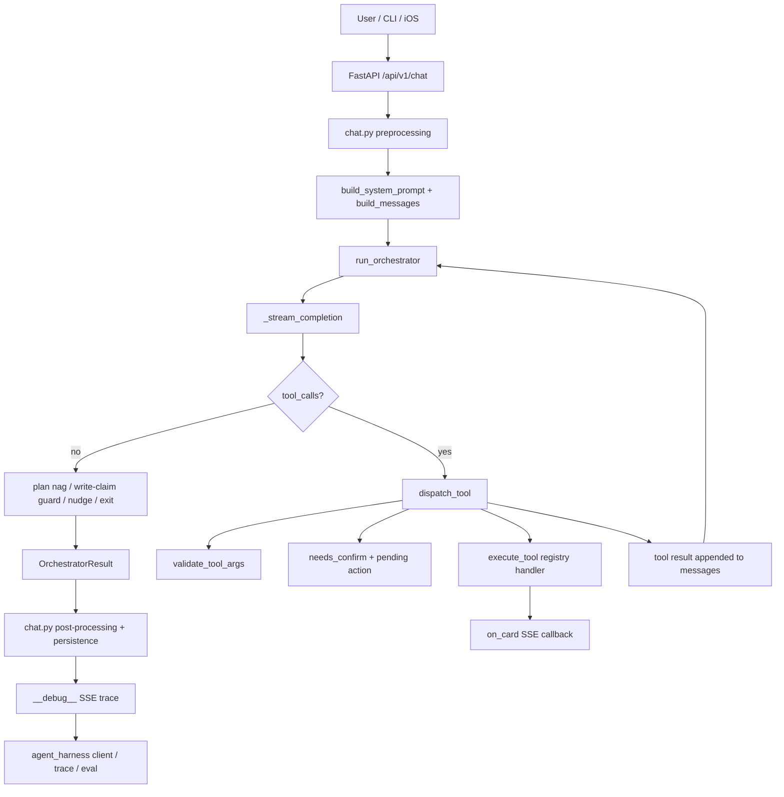

# Agent Runtime Step 1 Audit

This note captures the current CozyPup agent control flow before the next
runtime refactor. Its job is to make cleanup deliberate: delete only after a
responsibility has a new owner and tests prove the behavior still works.

## Purpose

The current agent already works, but several responsibilities are mixed across
large files. Before extracting an `AgentEngine` or cleaning redundant code, we
need a precise map of the existing system:

```text
FastAPI chat route
-> context/prompt construction
-> orchestrator loop
-> tool validation / confirmation / execution
-> SSE streaming
-> debug trace
-> harness parsing / replay / eval
```

This audit is Phase 2 Step 1: understand boundaries before moving them.

## Original File Framework

### `backend/app/routers/chat.py`

This file is the product-facing chat pipeline. It owns HTTP request shape,
auth dependency wiring, session lookup, image persistence, emergency
short-circuiting, prompt construction, SSE streaming, post-processing, profile
extraction, embedding writes, chat persistence, context summarization, and
debug trace emission.

Important internal phases:

```text
_event_generator
  Phase 0: session + image-save task
  Phase 1: pets, language, emergency detection, pre-processor
  Phase 2: prompt and message construction
  Phase 3: run_orchestrator in a task and bridge callbacks to SSE queue
  Phase 4: fallback execution, profile extraction, embeddings, persistence,
           summary trigger, debug trace, audit log
```

Current issue: `chat.py` is doing both product transport work and agent runtime
work. The route should eventually become a thin adapter around a reusable run
API, but not before trace and eval coverage are stable.

### `backend/app/agents/orchestrator.py`

This file is the current agent loop. It owns model streaming, tool-call
assembly, tool dispatch, confirm gates, nudge logic, plan nagging,
write-claim/fabrication guards, image injection, token accounting, and some
trace recording.

Important structure:

```text
OrchestratorResult
_describe_tool_call(...)
dispatch_tool(...)
_find_missed_tools(...)
_inject_nudge(...)
_thinking_text(...)
_stream_completion(...)
_can_skip_round2(...)
run_orchestrator(...)
```

Current issue: `run_orchestrator` is the loop, but `dispatch_tool` is also a
large policy/runtime layer. It validates, patches args, handles special control
tools, confirms dangerous actions, executes tools, commits DB, emits cards,
and mutates result state. That makes it hard to test planner, validator,
executor, and event stream independently.

### `backend/app/agents/tools/definitions.py`

This file is the LLM-facing tool schema source. It contains the OpenAI-style
function definitions, language-specific description replacement, strict-schema
patching, and legacy confirm injection compatibility.

Current issue: tool metadata is split across:

```text
definitions.py       LLM schema and descriptions
registry.py          handler registration
validation.py        argument validation
constants.py         confirmation policy and tool classes
orchestrator.py      special-case runtime policy
```

The next architecture should converge these into a typed `ToolSpec` layer, but
we should migrate gradually because the schema order and strict-mode patching
are production-sensitive.

### `backend/app/agents/tools/registry.py` and `tools/__init__.py`

`registry.py` owns the decorator-based handler registry. `tools/__init__.py`
imports all domain tool modules to populate that registry, re-exports legacy
handler names, and exposes `execute_tool`.

Current issue: this is mostly healthy. The risky part is backwards-compatible
re-exports. They may look redundant, but tests and older call sites may still
import them. Do not delete these until import usage has been checked.

### `backend/app/agents/validation.py`

This file owns deterministic tool argument validation. It is called by
`orchestrator.dispatch_tool` and by the deterministic post-processor fallback.

Current issue: validation is deterministic and should remain trusted code.
Future fine-tuned planner models should not bypass it.

### `backend/app/agents/trace_collector.py`

This is the in-backend debug trace collector. It records debug-only steps and
full non-streaming LLM responses when `X-Debug: true` is enabled, then
`chat.py` emits it as the final `__debug__` SSE event.

Current issue: trace is useful but not yet a stable agent event protocol. It is
debug-shaped, while the harness needs durable events such as model start/end,
tool call, tool result, final answer, error, and metrics.

### `backend/app/agent_harness/`

This is the new external control plane:

```text
client.py        HTTP/SSE client, ChatResult, SSE parser, legacy E2E bridge
cli.py           agent chat / replay / run / eval
trace_schema.py  normalized trace artifact
scenario.py      scenario fixture schema
runner.py        scenario execution
graders.py       deterministic grading
report.py        eval report summary
render.py        terminal rendering
artifacts.py     JSON artifact IO
```

Current issue: `client.py` is already the canonical client for harness and
legacy E2E tests, but `tests/e2e/conftest.py` still contains old copied
implementations above the alias imports. That is a concrete cleanup candidate.

## Current Runtime Flow



## Cleanup Candidates

These are candidates, not immediate deletions.

1. `tests/e2e/conftest.py` duplicated client/SSE parser code

   The bottom of the file aliases public names to `app.agent_harness.client`,
   but the old local `ChatResult`, `_parse_sse_lines`, `_build_chat_result`,
   and `E2EClient` definitions are still present above it. This is likely safe
   to remove after a focused test confirms e2e imports still bind to the
   canonical harness client.

2. `definitions.py` legacy confirm schema hook

   `_CONFIRM_OPT_IN_TOOLS` and `_inject_confirm_param` are retained for
   compatibility after confirm policy moved server-side. This is a possible
   cleanup later, but it is lower priority because tool schema generation is
   production-sensitive and tests/audit scripts mention `_BASE_TOOL_DEFINITIONS`.

3. Tool protocol split across five files

   This is architectural duplication rather than dead code. Do not delete it
   directly. Introduce `ToolSpec` first, then migrate fields one by one:
   schema, handler, validation, confirmation policy, safety metadata.

4. Trace duplication between backend debug trace and harness trace artifact

   This is not dead code. The backend trace is the source event stream; harness
   artifacts are normalized durable outputs. The cleanup target is to make the
   backend emit stable `AgentEvent`s so harness normalization becomes thinner.

5. `dispatch_tool` mixed responsibilities

   This is the biggest structural cleanup target. Split only after behavior is
   locked by tests:

   ```text
   parse/patch args
   validate
   confirm gate
   execute handler
   emit card/result event
   ```

## Safe Cleanup Order

1. Remove or shrink duplicate test infrastructure in `tests/e2e/conftest.py`.
2. Add stable event emission helpers around existing `TraceCollector`.
3. Extract a small `ToolRuntime` wrapper around `dispatch_tool` behavior
   without changing external behavior.
4. Introduce `ToolSpec` as a read-only adapter over existing definitions,
   registry, validation, and constants.
5. Only then reduce prompt/tool-description redundancy.

## Tests That Should Guard This Refactor

Focused local tests:

```bash
./.venv/bin/pytest tests/test_agent_harness.py \
  tests/test_agent_harness_scenario.py \
  tests/test_agent_harness_scenarios_exist.py \
  tests/test_agent_harness_trace_schema.py \
  tests/test_agent_runtime.py -q
```

For e2e client cleanup:

```bash
./.venv/bin/pytest tests/e2e/conftest.py tests/test_agent_harness.py -q
```

For orchestrator/tool behavior:

```bash
./.venv/bin/pytest tests/test_orchestrator.py tests/test_validation.py \
  tests/test_tool_registry.py -q
```

Live smoke after behavior-touching changes:

```bash
./.venv/bin/agent eval reports/smoke_scenarios --env prod \
  --report reports/smoke_eval_report.json
```

## Next Executable Step

The next code change should be a small cleanup with a clear safety net:

```text
Clean duplicated E2E client/SSE parser code from tests/e2e/conftest.py,
while keeping public imports and fixtures unchanged.
```

Why this first:

- It directly addresses codebase cleanliness.
- It does not touch production agent behavior.
- It validates that `app.agent_harness.client` is truly the canonical client.
- It teaches a key harness lesson: consolidate test/runtime clients before
  deeper agent loop refactors.

After that, move to stable runtime events.
